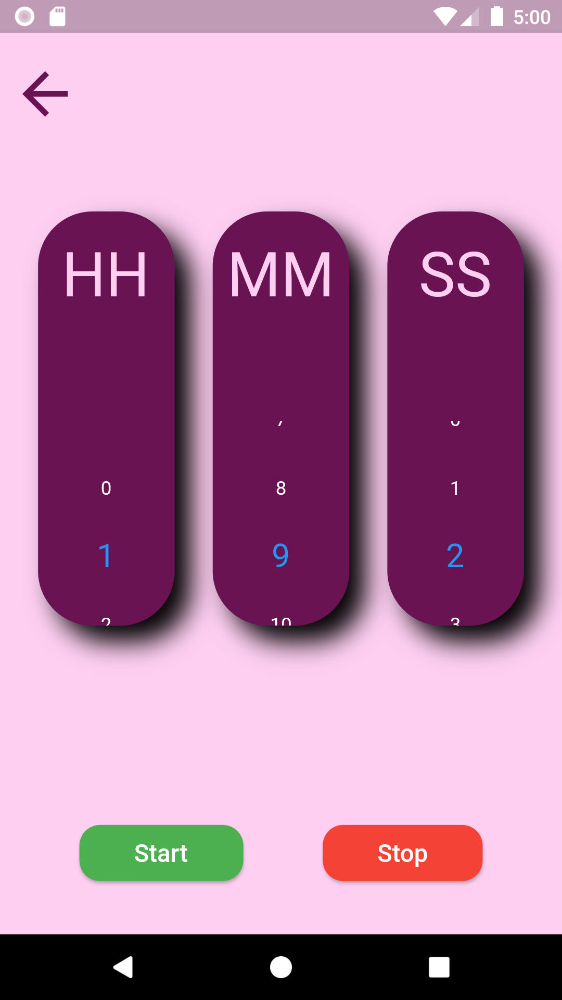
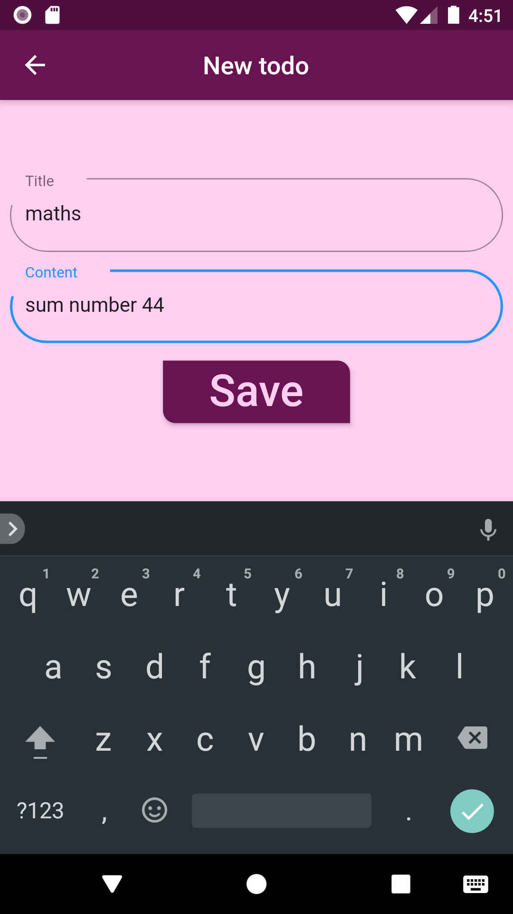
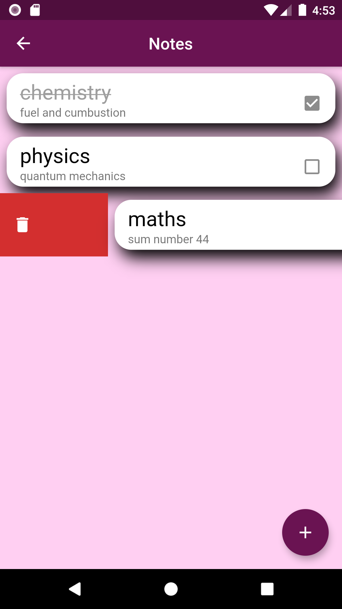

# StudE
An app which will help to focus on activities.

## SAMPLES

## FEATURES
* Has activities like Read, Write, Code and Meditate.
* Tips to perform the activities efficiently.
* Has a timer.
* Smooth instrumental music is played while the timer is on.
* Music might help the user to concentrate on the activities.
* Note taking feature and swipe to delete note.

## Download
- Download [StudE](https://github.com/varunmamtora06/StudE_Flutter_App/releases/download/v1.0/app-release.apk).
