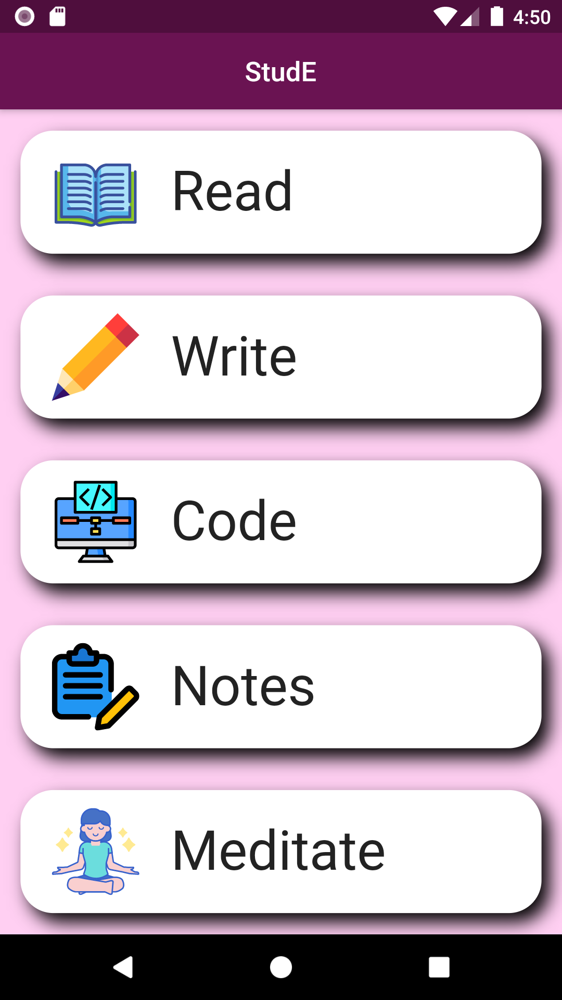
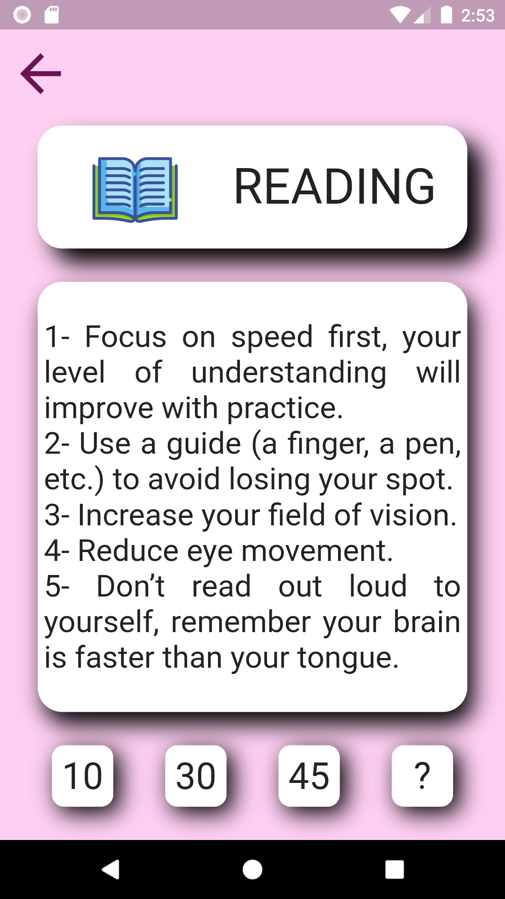
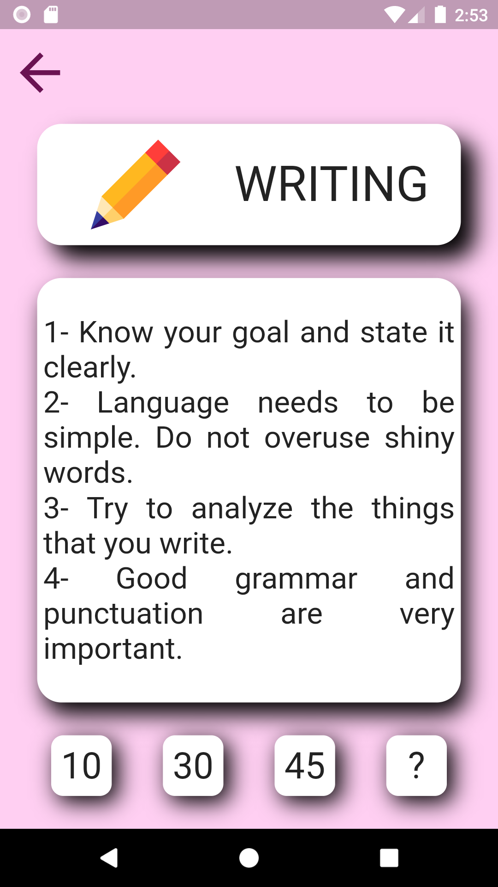
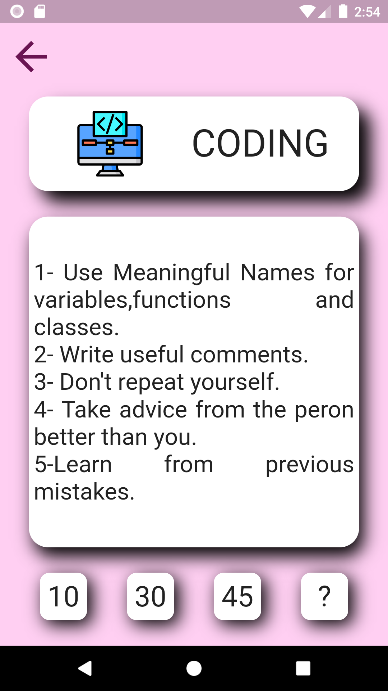
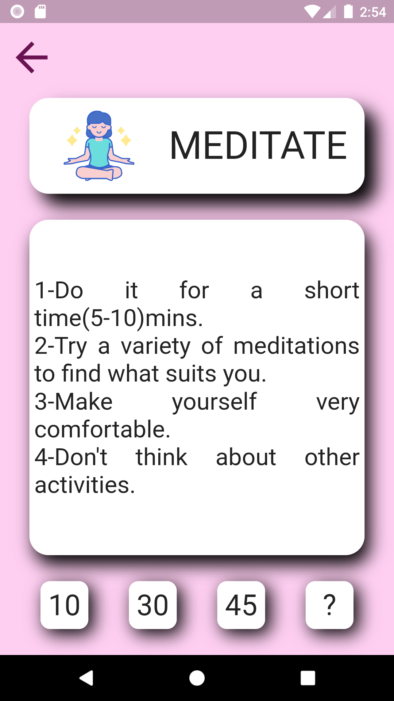
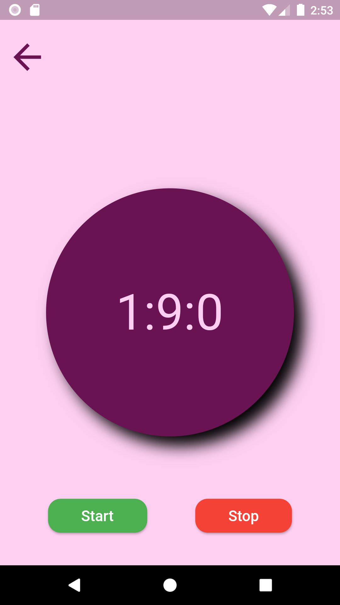

# StudE
An app which will help to focus on activities.

## SAMPLES

## FEATURES
* Has activities like Read, Write, Code and Meditate
* Tips to perform the activities efficiently
* Has a timer
* Smooth instrumental music is played while the timer is on
* Music might help the user to concentrate on the activities.
* Note taking feature(to be added)

##To Dos
- [x] Added music while timer is on
- [ ] To add Note taking feature
- [ ] To add about developer section
- [ ] To improve UI
